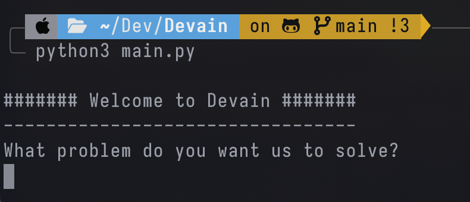

# Devyan

## Overview

**Devyan* is an AI-powered software development assistant that orchestrates a team of agents to solve programming tasks. It uses OpenAI's GPT-based agents to perform various roles such as architecture design, implementation, testing, and reviewing.


## Features

- **Architect Agent**: Designs the architecture of the solution based on the user input.
- **Programmer Agent**: Implements the solution as per the architecture design.
- **Tester Agent**: Tests the implemented solution to ensure it meets the requirements and is free of bugs.
- **Reviewer Agent**: Reviews the architecture, implementation, and test results to provide a comprehensive analysis.

## Requirements

- Python 3.7+
- `requests` library
- `langchain` library
- `python-decouple` library
- `crewai` library
- OpenAI API Key

## Installation

1. Clone the repository:
    ```sh
    git clone https://github.com/your-username/devain.git
    cd devain
    ```

2. Create a virtual environment:
    ```sh
    python -m venv venv
    source venv/bin/activate  # On Windows use `venv\Scripts\activate`
    ```

3. Install the dependencies:
    ```sh
    pip install -r requirements.txt
    ```

4. Set up environment variables:
    Create a `.env` file in the root directory of the project and add your OpenAI API key:
    ```env
    OPENAI_API_KEY=your_openai_api_key_here
    SERPER_API_KEY=your_serper_api_key_here
    ```

## Usage

1. Run the main script:
    ```sh
    python main.py
    ```

2. Follow the prompts:
    ```text
    ## Welcome to Devain##
    -------------------------------
    What problem do you want us to solve?
    ```

3. Enter the problem you want Devain to solve, and let the agents handle the rest.

## Project Structure

```plaintext
devain/
│
│ 
├── tools/
│   ├── __init__.py
│   ├── file_write.py
│   └── directory_write.py
│
├── agents.py
│
├── tasks.py
│
├── main.py
│
├── requirements.txt
│
└── README.md
```

## Contributing

1. Fork the repository.
2. Create your feature branch (`git checkout -b feature/your-feature`).
3. Commit your changes (`git commit -m 'Add some feature'`).
4. Push to the branch (`git push origin feature/your-feature``).
5. Open a pull request.

## Todo
- [x] Create Custom tool to write file
- [x] Create Custom tool to create directory
- [x] Change prompts in tasks, make it more detialed and clear
- [ ] Use pytoml


<picture>
  <source
    media="(prefers-color-scheme: dark)"
    srcset="
      https://api.star-history.com/svg?repos=theyashwanthsai/Devyan&type=Date&theme=dark
    "
  />
  <source
    media="(prefers-color-scheme: light)"
    srcset="
      https://api.star-history.com/svg?repos=theyashwanthsai/Devyan&type=Date
    "
  />
  
</picture>
